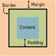

# Model Box
Cuando hablamos del modelo de cajas en CSS, estamos haciendo referencia a un sistema que tiene el navegador de interpretar las diferentes partes de lo que solemos denominar «caja»: un elemento HTML con unas ciertas dimensiones.

La representación básica del modelo de cajas se basa en varios conceptos importantes, como veremos a continuación:

1. El borde (border), en negro, es el límite que separa el interior del exterior del elemento.
2. El márgen (margin), en naranja, es la parte exterior del elemento, por fuera del borde.
3. El relleno (padding), en verde, es la parte interior del elemento, entre el contenido y el borde.
4. El contenido, en azul, es la parte interior del elemento, excluyendo el relleno.




Ejemplo:

````
div {
  width: 300px;
  border: 15px solid green;
  padding: 50px;
  margin: 20px;
}
````

Para establecer correctamente el ancho y alto de un elemento en todos los navegadores, necesita saber cómo funciona el modelo de caja.

Importante: cuando establece las propiedades de ancho y alto de un elemento con CSS, simplemente establece el ancho y alto del área de contenido . Para calcular el tamaño completo de un elemento, también debe agregar relleno, bordes y márgenes.

Ejemplo
Este elemento ``<div>`` tendrá un ancho total de 350px: 
````
div {
  width: 320px;
  padding: 10px;
  border: 5px solid gray;
  margin: 0;
}
````
Aquí está el cálculo:
````
320px (ancho)
+ 20px (relleno izquierdo + derecho)
+ 10px (borde izquierdo + derecho)
+ 0px (margen izquierdo + derecho)
= 350px

````
El ancho total de un elemento debe calcularse así:

Ancho total del elemento = ancho + relleno izquierdo + relleno derecho + borde izquierdo + borde derecho + margen izquierdo + margen derecho

La altura total de un elemento debe calcularse así:

Altura total del elemento = altura + relleno superior + relleno inferior + borde superior + borde inferior + margen superior + margen inferior


