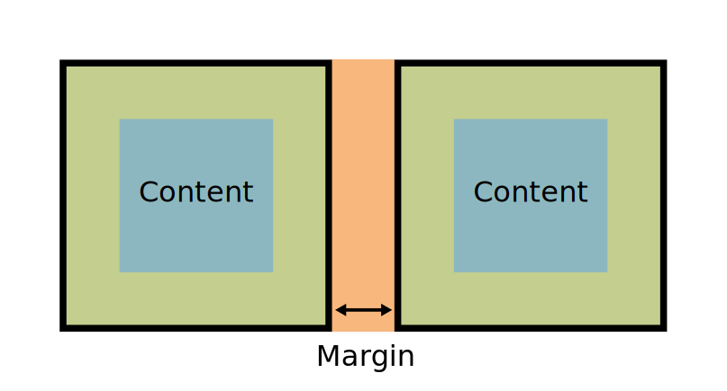

## Margin y padding(relleno)
En el modelo de cajas, los márgenes (margin) son los espacios exteriores de un elemento. Es decir, el espacio que hay entre el borde de un elemento y su exterior.

### La propiedad margin (márgenes) 
El tamaño de dichos márgenes se puede alterar en conjunto (de forma general) o de forma específica a cada una de las zonas del elemento (izquierda, derecha, arriba o abajo). Veamos primero las propiedades específicas para cada zona:


* margin-top	auto | 	Establece un tamaño de margen superior.
* margin-left	auto | 	Establece un tamaño de margen a la izquierda.
* margin-right	auto | 	Establece un tamaño de margen a la derecha.
margin-bottom	auto | 	Establece un tamaño de margen inferior.

Podemos aplicar diferentes márgenes a cada zona de un elemento utilizando cada una de estas propiedades, o dejando al nevegador que lo haga de forma automática indicando el valor auto.

> Existe un truco muy sencillo y práctico para centrar horizontalmente un elemento en pantalla. Basta con aplicar un ancho fijo al contenedor: width: 500px (por ejemplo) y luego aplicar un margin: auto. De esta forma, el navegador, al conocer el tamaño del elemento (y por omisión, el resto del tamaño de la ventana) se encarga de repartirlo equitativamente entre el margen izquierdo y el margen derecho, quedando centrado el elemento.

Hay que recordar diferenciar bien un margin de un padding, puesto que no son la misma cosa. Los rellenos (padding) son los espacios que hay entre los bordes del elemento en cuestión y el contenido del elemento (por la parte interior). Mientras que los márgenes (margin) son los espacios que hay entre los bordes del elemento en cuestión y los bordes de otros elementos (parte exterior).

Observese también el siguiente ejemplo para ilustrar el solapamiento de márgenes. Por defecto, si tenemos dos elementos adyacentes con, por ejemplo, margin: 20px cada uno, ese espacio de margen se solapará y tendremos 20px en total, y no 40px (la suma de cada uno) como podríamos pensar en un principio:



La parte en naranja es la que consideramos margin, mientras que la parte en verde es la que consideramos padding.

### La propiedad padding (rellenos) 
Al igual que con los márgenes, los padding tienen varias propiedades para indicar el relleno de cada zona:

Propiedad	Valor	Significado
padding-top	0 | 	Aplica un relleno interior en el espacio superior de un elemento.
padding-left	0 | 	Aplica un relleno interior en el espacio izquierdo de un elemento.
padding-right	0 | 	Aplica un relleno interior en el espacio derecho de un elemento.
padding-bottom	0 | 	Aplica un relleno interior en el espacio inferior de un elemento.

Como se puede ver en la tabla, por defecto no hay relleno (el relleno está a cero), aunque puede modificarse tanto con las propiedades anteriores como la propiedad de atajo que veremos a continuación.

### Atajo: Modelo de cajas. Propiedades shorthand 
Al igual que en otras propiedades de CSS, también existe una propiedad de atajo o abreviadas denominada margin y padding. Con estas propiedades evitamos tener que escribir los valores de cada parte (izquierda, derecha, arriba, abajo...), especialmente importante si es el mismo valor en las cuatro.

No obstante, tenemos 4 modalidades, que dependen del número de parámetros de la propiedad:


* margin o padding 		1 parámetro. Aplica el mismo margen a todos los lados.
*	2 parámetros. Aplica margen top/bottom y left/right.
* 3 parámetros. Aplica margen top, left/right y bottom.
* 4 parámetros. Aplica margen top, right, bottom e left.
Con la propiedad border-width pasa exactamente lo mismo que con margin y padding, actuando en este caso en relación al grosor del borde de un elemento. Veamos algunos ejemplos:
````
.examples {
  margin: 15px;
  /* Equivalente a margin: 15px 15px 15px 15px; */

  margin: 20px 10px;
  /* Equivalente a margin: 20px 10px 20px 10px; */

  margin: 20px 10px 5px;
  /* Equivalente a margin: 20px 10px 5px 10px; */
}
````
Ojo: Aunque al principio es muy tentador utilizar márgenes negativos para ajustar posiciones y colocar los elementos visualmente, se aconseja no utilizar dicha estrategia salvo para casos muy particulares y concretos, ya que a la larga es una mala práctica que hará que nuestro código sea de peor calidad y menos predecible.